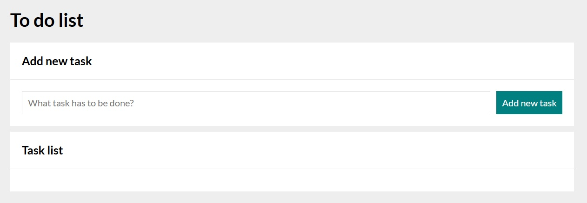
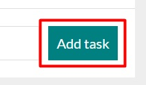
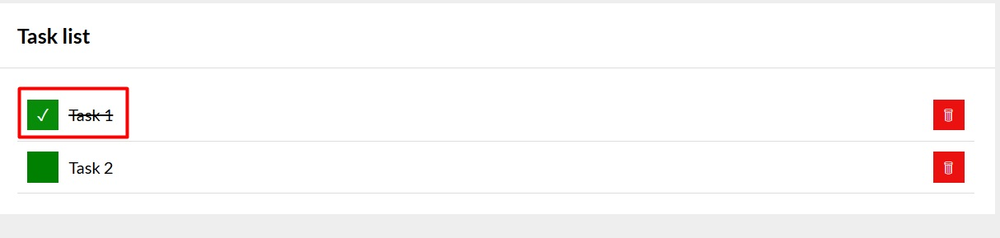
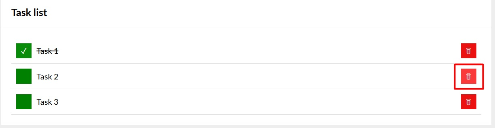
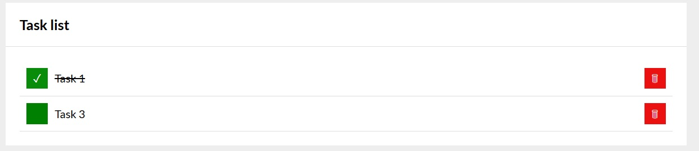
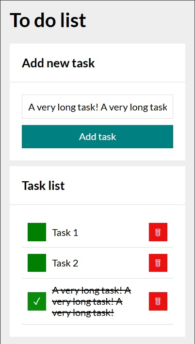

# To do list

## Description
Simple web application that allows users to create *and/or* modify **To do list**

## Live demo

[View live demo - To do list](https://patkolino.github.io/ToDoList/)

## Usage
1. Within input field, enter the task you want to complete (or have completed) 

 

2. Click "Add task" button 

 

3. Task is added to the Task list 

 

4. Once a task is added, list is created with option to mark task as done or to delete it

5. By click the green square on the left side, task is marked as done. A checkmark will appear and the task will be crossed over 

6. By clicking red button with thrash bin icon, tas will be deleted 
 
 

## Additional information
- Webpage was built using **HTML**, **CSS** and **JavaScript**
- Normalize CSS included (https://cdnjs.com/libraries/normalize) 
- Code written according to BEM standards
- Grid layout model was used
- Page icon was added
- @media at-rule was placed so that application is properly and correctly displayed on lower resolution 

